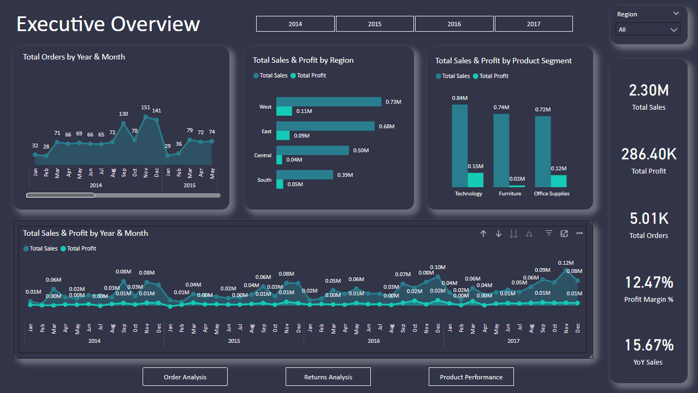
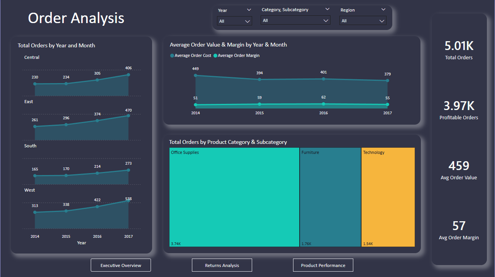

Northstar Super Store
Retail Performance Report

Background:
This dataset analyzes sales performance for the NorthStar Super Store from 2014 to 2017. It includes a total of 9,994 transactions and provides detailed insights into key business metrics such as product-level sales, returns, and associated costs.

The data enables analysis of overall revenue trends across the four-year period, as well as deeper evaluation of product performance, including which items or categories generate the highest sales and which contribute most to returns. Additionally, cost-related fields allow for profitability analysis, helping identify high-margin versus low-margin products.

By combining sales, returns, and cost data, this dataset supports a comprehensive assessment of business performance, operational efficiency, and potential areas for improvement, such as reducing return rates or optimizing product offerings.

Northstar Super Store Metrics

Total sales amount to $2.3 million, generating a total profit of $286,000, resulting in an overall profit margin of approximately 12.47%. Order volume has grown significantly over time, increasing from 969 orders in 2014 to 1,687 in 2017, reflecting strong expansion in business activity.

Sales exhibit clear seasonality, with consistent increases from September through December across most regions, except for the South. Year-over-year sales have grown by 15.67%, indicating solid revenue momentum. However, profit margins have remained relatively stable since 2014, suggesting that increased sales volume has not translated into improved profitability.

From a regional perspective, sales are primarily concentrated in the East and West, while the Central and South regions lag behind. Additional data would be needed to determine whether this gap is driven by differences in demand, distribution strategy, or market penetration.

At the product category level, profitability varies considerably. The Furniture segment underperforms with a 2.49% profit margin, whereas Office Supplies (17.04%) and Technology (17.4%) generate substantially higher returns. This disparity highlights a clear opportunity to prioritize investment in higher-margin categories while reassessing pricing, cost structure, or strategic positioning within the Furniture segment.

Order Analysis

Total orders follow the same upward trend highlighted in the executive summary, with year-over-year growth across all regions. By 2017, the West leads with 538 orders, followed by the East (470), Central (406), and South (273), indicating stronger demand concentration in the West and East.

Looking at average order value (AOV) and average order margin by category:
Furniture: AOV declined from $430 to $377, while average order margin dropped significantly from $15 to $5, reinforcing the category’s weak profitability and deteriorating performance.
Office Supplies: AOV decreased slightly from $173 to $163, while average order margin remained stable at approximately $31, indicating consistent and reliable performance despite minor declines in order value.
Technology: AOV decreased from $528 to $420, but average order margin increased to $96, suggesting improved profitability per order despite lower sales value.

Overall, while order values have declined across all categories, margin performance varies—improving in Technology, remaining stable in Office Supplies, and weakening significantly in Furniture.

In terms of product mix, the overall distribution has remained relatively consistent year-over-year. However, regional differences are evident. Notably, the Central region has experienced growth in the Office Supplies category, while other regions have maintained a more stable product mix. This suggests localized demand shifts that may warrant region-specific strategies.

Returns Analysis

The West region leads all regions in returns, with an average return rate of 11.99%. In 2014, the West’s return rate was 10.38%, rising to 13.20% in 2017. This has resulted in $19,660 of lost profit from returned sales, while the other regions remain between $0 and $3,000 in lost profit. The return rate for other regions hovers around 3%, highlighting a significant discrepancy.

Across categories, Office Supplies have a return rate of 6.25%, while Furniture and Technology average around 8%.

The primary focus should be on the West region to understand why its return rate is nearly four times higher than other regions. Once the regional issue is addressed, a more granular analysis by product and category can be conducted to further optimize returns and minimize lost profit.

Returns Analysis PDF: [View Returns Analysis] https://github.com/jordanfoleyreis/PowerBI_Project/blob/main/Returns_Analysis.pdf

Product Analysis

Full PowerBI Dashboard: [Download Power BI Dashboard] (https://github.com/jordanfoleyreis/PowerBI_Project/raw/main/Sales_Analysis_JordanFoleyReis.pbix)

Other 
Customer/Region Analysis

Within the second dashboard, the Furniture category continues to underperform in profitability. Only 64.34% of all customer orders in Furniture are profitable, a trend that persists consistently from 2014 through 2017. In comparison, Office Supplies and Technology maintain profitability rates between 82% and 87% across all years.

Profitability also varies significantly by region. Within Furniture, the Central region has only 32.51% of orders profitable, resulting in an overall loss of $3,000, while the East region achieves 66.6%, and the West and South regions reach 81% and 76.3%, respectively. This indicates that regional specialization could help improve overall profit margins.

Looking at products, 83.62% of all products across categories are profitable. Within Furniture, this drops to 67.63%, while Office Supplies and Technology maintain 85–88% profitability across all years.

Overall, trimming underperforming products and addressing low-profit regions would make the business more efficient and support future growth initiatives.

Customer/Region Analysis PDF:[View Customer/Region Analysis] https://github.com/jordanfoleyreis/PowerBI_Project/blob/main/Product_Customer_Peformance.pdf

