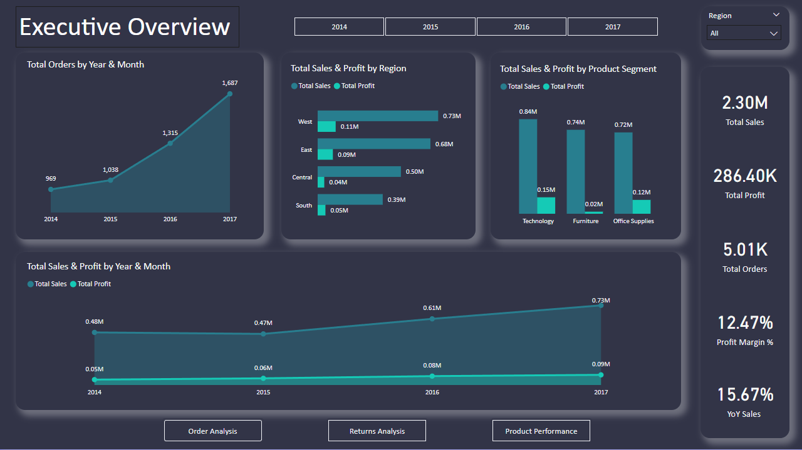

Northstar 
Retail Performance Report

Background:
This dataset analyzes sales performance for the NorthStar Super Store from 2014 to 2017. It includes a total of 9,994 transactions and provides detailed insights into key business metrics such as product-level sales, returns, and associated costs.

The data enables analysis of overall revenue trends across the four-year period, as well as deeper evaluation of product performance, including which items or categories generate the highest sales and which contribute most to returns. Additionally, cost-related fields allow for profitability analysis, helping identify high-margin versus low-margin products.

By combining sales, returns, and cost data, this dataset supports a comprehensive assessment of business performance, operational efficiency, and potential areas for improvement, such as reducing return rates or optimizing product offerings.

Northstar Super Store Metrics

Executive Summary 

Totals sales sits at $2.3 Million with a total profit of $286,000. Total orders have increased alot from 969 in 2014 to 1,687 in 2017. There looks to be increased sales around September to Decemeber indicating seasonality. This trend follows for all regions excluding the south.  Year-over-year sales have increased by 15.67%, indicating strong overall revenue growth. Despite this increase, profit margins have remained stable since 2014 at approximately 12.47%, suggesting that growth has not translated into proportional margin expansion. This trend can also be seen in order count totals as well. Sales activity is primarily concentrated in the East and West regions, with the Central and South regions contributing comparatively lower revenue. Additional market and regional data is required to determine whether this gap is driven by demand, distribution, or market penetration limitations. Profitability varies significantly by product category. The Furniture segment underperforms with a 2.49% profit margin, while Office Supplies (17.04%) and Technology (17.4%) deliver substantially higher returns. This disparity highlights an opportunity to prioritize investment and growth strategies in the two most profitable categories while reassessing the role and cost structure of Furniture.

Executive Overview PDF: [View Executive Overview] https://github.com/jordanfoleyreis/PowerBI_Project/blob/main/Executive_Overview.pdf 

Customer/Region Analysis

Within the second dashboard, the Furniture category continues to underperform in profitability. Only 64.34% of all customer orders in Furniture are profitable, a trend that persists consistently from 2014 through 2017. In comparison, Office Supplies and Technology maintain profitability rates between 82% and 87% across all years.

Profitability also varies significantly by region. Within Furniture, the Central region has only 32.51% of orders profitable, resulting in an overall loss of $3,000, while the East region achieves 66.6%, and the West and South regions reach 81% and 76.3%, respectively. This indicates that regional specialization could help improve overall profit margins.

Looking at products, 83.62% of all products across categories are profitable. Within Furniture, this drops to 67.63%, while Office Supplies and Technology maintain 85–88% profitability across all years.

Overall, trimming underperforming products and addressing low-profit regions would make the business more efficient and support future growth initiatives.

Customer/Region Analysis PDF:[View Customer/Region Analysis] https://github.com/jordanfoleyreis/PowerBI_Project/blob/main/Product_Customer_Peformance.pdf

Order Analysis

Returns Analysis

The West region leads all regions in returns, with an average return rate of 11.99%. In 2014, the West’s return rate was 10.38%, rising to 13.20% in 2017. This has resulted in $19,660 of lost profit from returned sales, while the other regions remain between $0 and $3,000 in lost profit. The return rate for other regions hovers around 3%, highlighting a significant discrepancy.

Across categories, Office Supplies have a return rate of 6.25%, while Furniture and Technology average around 8%.

The primary focus should be on the West region to understand why its return rate is nearly four times higher than other regions. Once the regional issue is addressed, a more granular analysis by product and category can be conducted to further optimize returns and minimize lost profit.

Returns Analysis PDF: [View Returns Analysis] https://github.com/jordanfoleyreis/PowerBI_Project/blob/main/Returns_Analysis.pdf

Product Analysis

Full PowerBI Dashboard: [Download Power BI Dashboard] (https://github.com/jordanfoleyreis/PowerBI_Project/raw/main/Sales_Analysis_JordanFoleyReis.pbix)

Other 

